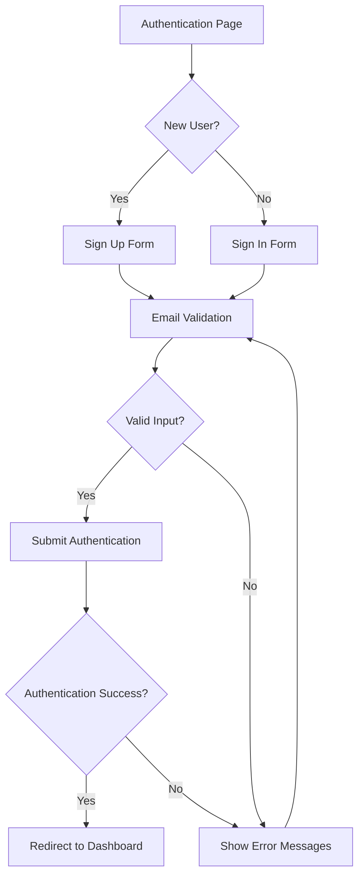

## 1. Product Overview
Unified authentication interface combining sign-in and sign-up functionality in a single, responsive layout. This design provides seamless user authentication while maintaining consistent brand identity through existing color schemes.

## 2. Core Features

### 2.1 User Roles
| Role | Registration Method | Core Permissions |
|------|---------------------|------------------|
| New User | Email registration via signup form | Account creation, immediate access to core features |
| Existing User | Email login via signin form | Access to personal dashboard and saved data |

### 2.2 Feature Module
Authentication requirements consist of the following main components:
1. **Unified Authentication Page**: Toggle between sign-in and sign-up modes
2. **Form Sections**: Email/password inputs with validation
3. **Social Authentication**: Optional third-party login buttons
4. **Error Handling**: User-friendly error messages and validation states

### 2.3 Page Details
| Page Name | Module Name | Feature description |
|-----------|-------------|---------------------|
| Authentication | Form Toggle | Switch between sign-in and sign-up modes with smooth transitions |
| Authentication | Email Input | Validate email format, show real-time feedback |
| Authentication | Password Input | Show/hide password toggle, strength indicator for signup |
| Authentication | Submit Button | Loading states, disabled during submission |
| Authentication | Error Messages | Inline validation errors, server response errors |
| Authentication | Success Redirect | Automatic redirect to dashboard/home after successful auth |

## 3. Core Process
**User Authentication Flow:**
1. User lands on authentication page
2. Selects sign-in or sign-up mode
3. Fills required fields (email, password)
4. Submits form with validation
5. Receives feedback (success/error)
6. Redirects to authenticated area on success

## 4. User Interface Design

### 4.1 Design Style
- **Primary Colors**: Use existing brand color palette
- **Button Style**: Rounded corners (8px radius), hover states with 10% darker shade
- **Typography**: System font stack, 16px base size for inputs, 14px for helper text
- **Layout**: Card-based design with centered container (max-width: 400px)
- **Icons**: Minimal line icons for email, password, and social providers

### 4.2 Page Design Overview
| Module Name | UI Elements |
|-------------|-------------|
| Form Container | White background, subtle shadow (0 2px 8px rgba(0,0,0,0.1)), 24px padding |
| Toggle Switch | Tab-based selector, active state uses primary color, smooth transitions |
| Input Fields | 48px height, 1px border (#e1e5e9), focus state with primary color border |
| Submit Button | Full-width, 48px height, primary color background, white text |
| Error States | Red border on inputs, red text below fields, shake animation on error |
| Social Auth | Outlined buttons with provider logos, horizontal layout on desktop |

### 4.3 Responsiveness
- **Desktop-first**: 400px fixed width container centered on larger screens
- **Mobile**: 100% width with 16px horizontal padding, stacked social auth buttons
- **Touch optimization**: 48px minimum touch targets, increased spacing between elements
- **Breakpoint**: 768px - switch from fixed width to full-width layout

### 4.4 Accessibility Features
- **Keyboard navigation**: Full keyboard support with proper tab order
- **Screen reader**: ARIA labels on all interactive elements
- **Color contrast**: WCAG 2.1 AA compliance for text and background colors
- **Focus indicators**: Visible focus rings on all interactive elements
- **Error announcements**: Screen reader announcements for validation errors