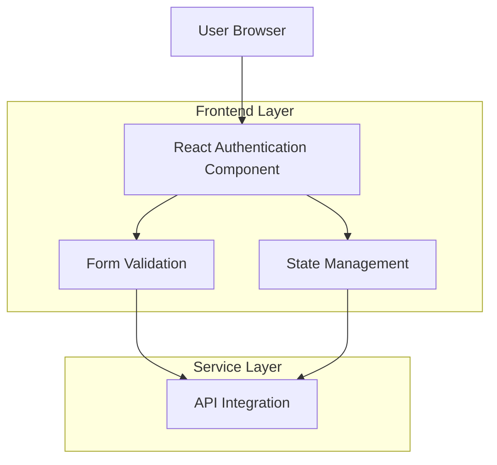

## 1. Architecture Design



## 2. Technology Description
- **Frontend**: React@18 + tailwindcss@3 + vite
- **Initialization Tool**: vite-init
- **Form Validation**: React Hook Form + Zod
- **State Management**: React Context/Local State
- **Animation**: Framer Motion (optional)

## 3. Route Definitions
| Route | Purpose |
|-------|---------|
| /auth | Unified authentication page with sign-in/sign-up toggle |
| /auth/callback | OAuth callback handler for social authentication |
| /auth/reset-password | Password reset flow (optional extension) |

## 4. Component Architecture

### 4.1 Core Components
```typescript
// AuthenticationLayout.tsx
interface AuthLayoutProps {
  mode: 'signin' | 'signup';
  onModeChange: (mode: 'signin' | 'signup') => void;
  onSubmit: (data: AuthFormData) => Promise<void>;
  isLoading: boolean;
  error: string | null;
}

interface AuthFormData {
  email: string;
  password: string;
  confirmPassword?: string;
}
```

### 4.2 Form Validation Schema
```typescript
// validation/authSchema.ts
import { z } from 'zod';

export const signInSchema = z.object({
  email: z.string().email('Invalid email format'),
  password: z.string().min(8, 'Password must be at least 8 characters')
});

export const signUpSchema = z.object({
  email: z.string().email('Invalid email format'),
  password: z.string()
    .min(8, 'Password must be at least 8 characters')
    .regex(/[A-Z]/, 'Password must contain at least one uppercase letter')
    .regex(/[a-z]/, 'Password must contain at least one lowercase letter')
    .regex(/[0-9]/, 'Password must contain at least one number'),
  confirmPassword: z.string()
}).refine((data) => data.password === data.confirmPassword, {
  message: "Passwords don't match",
  path: ["confirmPassword"],
});
```

## 5. Responsive Design Implementation

### 5.1 Breakpoint Strategy
```css
/* Mobile First Approach */
.container {
  @apply w-full px-4 py-8;
}

@media (min-width: 768px) {
  .container {
    @apply max-w-md mx-auto py-16;
  }
}

/* Touch-friendly sizing */
.form-input {
  @apply h-12 text-base; /* 48px height minimum */
}

.submit-button {
  @apply h-12 min-h-[48px];
}
```

### 5.2 Accessibility Implementation
```typescript
// ARIA labels and keyboard navigation
const AuthForm = () => {
  return (
    <form 
      role="form"
      aria-label={mode === 'signin' ? 'Sign in form' : 'Sign up form'}
      onSubmit={handleSubmit}
    >
      <input
        type="email"
        aria-label="Email address"
        aria-required="true"
        aria-invalid={errors.email ? 'true' : 'false'}
        aria-describedby={errors.email ? 'email-error' : undefined}
        {...register('email')}
      />
      {errors.email && (
        <span id="email-error" role="alert" className="text-red-600">
          {errors.email.message}
        </span>
      )}
    </form>
  );
};
```

## 6. State Management Pattern

### 6.1 Local State Structure
```typescript
interface AuthState {
  mode: 'signin' | 'signup';
  isLoading: boolean;
  error: string | null;
  formData: {
    email: string;
    password: string;
    confirmPassword?: string;
  };
}

const useAuthForm = () => {
  const [state, setState] = useState<AuthState>({
    mode: 'signin',
    isLoading: false,
    error: null,
    formData: { email: '', password: '' }
  });

  const handleSubmit = async (data: AuthFormData) => {
    setState(prev => ({ ...prev, isLoading: true, error: null }));
    
    try {
      await authenticateUser(data, state.mode);
      // Handle success
    } catch (error) {
      setState(prev => ({ 
        ...prev, 
        error: error.message,
        isLoading: false 
      }));
    }
  };

  return { state, handleSubmit, setMode };
};
```

## 7. Performance Optimization

### 7.1 Component Lazy Loading
```typescript
const AuthLayout = lazy(() => import('./components/AuthLayout'));
const SocialAuth = lazy(() => import('./components/SocialAuth'));
```

### 7.2 Form Debouncing
```typescript
const debouncedValidation = useMemo(
  () => debounce((value: string) => {
    // Validate field
  }, 300),
  []
);
```

## 8. Error Handling Strategy

### 8.1 Error States
```typescript
interface ErrorState {
  field?: string;
  message: string;
  type: 'validation' | 'server' | 'network';
}

const ErrorDisplay: React.FC<{ error: ErrorState }> = ({ error }) => {
  const getErrorStyles = () => {
    switch (error.type) {
      case 'validation':
        return 'border-red-500 text-red-600';
      case 'server':
        return 'border-orange-500 text-orange-600';
      case 'network':
        return 'border-yellow-500 text-yellow-600';
    }
  };

  return (
    <div role="alert" className={`p-3 rounded-lg ${getErrorStyles()}`}>
      <span className="text-sm">{error.message}</span>
    </div>
  );
};
```