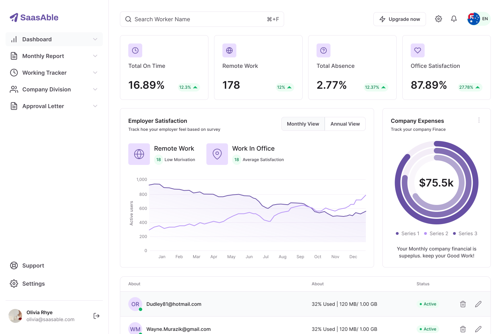

# Orgaflow

Multi-tenant SaaS for the full client workflow — **customers → estimates → approval → invoices → payments → execution** — in one product.



## Portfolio highlights (LinkedIn-ready)

- Built a multi-tenant SaaS with **organization workspaces**, **RBAC/permissions**, and **plan-based feature gating**.
- Implemented a **type-safe full-stack API** with **tRPC v11 + Zod + SuperJSON**, integrated with **TanStack React Query**.
- Designed an IAM system with **owner bypass**, **role permissions** (`resource:action`), and **automatic permission dependency expansion**.
- Built public client experiences: **shareable estimate/invoice links**, **approve/reject flow**, **PDF download**, and **attachments**.
- Implemented file storage with **Vercel Blob** + a DB-backed file catalog (`document_files`) with per-document visibility controls.
- Structured the app as a domain-oriented codebase and documented architecture decisions in `docs/`.

## What Orgaflow does

Orgaflow centralizes sales, billing, and operations into a single workflow:

Customer → Estimate → Client approval → Invoice → Payment → Work execution

### Core modules

- **Customers**: contact data + document history.
- **Items**: reusable products/services to assemble estimates/invoices quickly.
- **Estimates**: create/share estimates; clients can approve/reject on a public page.
- **Invoices**: create invoices manually or from estimates; track due dates and payment status.
- **Payments**: register payments and track statuses (online collection via Stripe Connect is planned).
- **Expenses**: track operational costs (with receipt uploads).
- **Tasks / Kanban**: execute work after approval (domain modeled; UI evolves over time).
- **Automations**: connect domain events (e.g., “estimate approved” → create task).
- **Settings**: organization preferences, billing, and user account settings.

For product narrative (high-level), see `README_orgaflow.md`.

## Tech stack

| Layer | Technology |
| --- | --- |
| App & routing | Next.js `16.2.0` (App Router) + React `19` |
| API | tRPC v11 (end-to-end types) |
| Auth | Auth.js / NextAuth v5 (beta) + Drizzle adapter |
| Database | PostgreSQL + Drizzle ORM (+ SQL migrations in `drizzle/`) |
| Validation & forms | Zod + React Hook Form |
| UI | Tailwind CSS + Radix UI primitives + custom components in `src/components/ui/` |
| Files | Vercel Blob (`@vercel/blob`) + `document_files` table |
| Billing | Stripe subscriptions (price IDs in `.env`) |
| Email | Resend + Nodemailer (project wiring depends on environment) |
| Tooling | TypeScript, pnpm, Biome |

## Design goals / how it was built

**Primary goals**

- **Single source of truth on the backend** (auth, org membership, permissions, plan gating).
- **End-to-end type safety** across API + UI (no “stringly-typed” contracts).
- **Multi-tenant by default** (every domain record is org-scoped, enforced server-side).
- **Composable UI** (shared primitives + domain components; minimal duplication).

**Implementation approach (high level)**

1. Defined the domain workflow and document lifecycle (estimate → invoice) and wrote supporting architecture docs (`docs/`).
2. Implemented IAM foundations (owner policy, permission catalog, role CRUD, menu filtering) before building deep UI.
3. Built a typed tRPC layer with consistent procedure tiers (`public/protected/organization/owner`) and shared middleware.
4. Modeled database schemas and migrations with Drizzle and enforced org scoping at query boundaries.
5. Built forms with React Hook Form + Zod and a small set of reusable UI building blocks (`src/components/ui/`).
6. Added public client pages (tokens + expiry rules), attachments, and PDF generation endpoints.
7. Integrated Stripe subscription scaffolding and server-side plan gating (feature availability by plan).

## Architecture overview

### Multi-tenancy & “active organization”

- Each signed-in user can belong to multiple organizations (tenants).
- Org-scoped actions require an **active organization**:
  - sent via header `x-organization-id`, or
  - inferred from cookie `active_organization_id`
- Server-side enforcement lives in `src/server/trpc/init.ts` (`organizationProcedure` / `ownerProcedure`) and the IAM resolver `src/server/services/iam/get-current-ability.ts`.

### IAM (Identity & Access Management)

Canonical spec: `docs/iam-architecture-technical.md`.

**Three access modes**

1. **Self** (account scope): authenticated user settings (no org role/permissions).
2. **Owner**: if `organization_members.is_owner = true`, full access to the org (bypasses permissions).
3. **Role-based**: non-owners get `resource:action` permissions (e.g., `customer:view`, `invoice:create`).

**Implementation notes**

- Permission catalog + helpers live in `src/server/iam/` (`permissions.ts`, `ability.ts`, `permission-utils.ts`).
- Navigation is generated and filtered based on the resolved ability (`menu.ts`, `filter-menu.ts`).
- Role saving expands permission dependencies automatically (e.g., `invoice:create` implies `invoice:view`, etc.).

### Typed API (tRPC)

- tRPC procedures are layered by access level:
  - `publicProcedure`: no auth (used for some public flows)
  - `protectedProcedure`: signed-in user
  - `organizationProcedure`: signed-in + active org + membership + ability
  - `ownerProcedure`: same as org procedure + owner-only
- Procedure composition & error formatting live in `src/server/trpc/init.ts`.
- Client wiring is in `src/trpc/` (TanStack React Query + batched HTTP link).

### Files & attachments (Vercel Blob)

- Upload endpoint: `src/app/api/upload/route.ts`
  - validates auth, active org, membership
  - validates resource ownership (expense/estimate/invoice)
  - restricts MIME types + enforces size limit (25MB)
- Metadata is stored in `document_files` (Drizzle schema in `src/server/db/schemas`).
- UI supports:
  - upload-before-create (pending files) and upload-after-create flows
  - list/delete/toggle visibility (varies by domain)

### Public client portal (share links)

- Public estimate page: `src/app/estimate/[token]/...`
  - approve/reject flow (with an optional rejection reason)
  - attachment previews (only public files)
- Public invoice page: `src/app/invoice/[token]/...`
- Link expiry is supported at the preference level (`organizationPreferences.publicLinksExpire*`).

### PDF generation

PDFs are generated server-side using `@react-pdf/renderer`:

- Authenticated: `src/app/api/pdf/estimate/[id]/route.ts`, `src/app/api/pdf/invoice/[id]/route.ts`
- Public link (estimate): `src/app/api/pdf/estimate/public/[token]/route.ts`

PDF template component: `src/lib/pdf/document-pdf`.

### Billing & plan gating (Stripe)

- Subscription price IDs are configured via `.env` (see `.env.example`).
- Feature gating is done server-side via middleware (`requirePlan(...)` in `src/server/trpc/init.ts`).
- Plan rules and strategy docs live in `docs/orgaflow-pricing-strategy.md` and `docs/orgaflow-free-plan-limit-strategy.md`.

## Getting started (local development)

### Prerequisites

- Node.js (recommended: Node 20+)
- pnpm (repo uses `pnpm@10.x`)
- PostgreSQL

### Install

```bash
pnpm install
```

### Environment variables

Copy `.env.example` to `.env` and fill the required values:

- `DATABASE_URL` (PostgreSQL connection string)
- `AUTH_SECRET`
- `NEXT_PUBLIC_APP_URL` (e.g. `http://localhost:3000`)
- `BLOB_READ_WRITE_TOKEN` (for uploads)
- Stripe variables if you want to test billing flows
- Resend variables if you want to test email flows

### Database

```bash
pnpm db:generate
pnpm db:migrate
```

In development you can also use:

```bash
pnpm db:push
```

If `pnpm db:migrate` fails with “already exists”, your DB likely has schema objects from `db:push` (or manual SQL) but an empty `drizzle.__drizzle_migrations`. For dev, the simplest fix is recreating the database and running `pnpm db:migrate` again.

### Run

```bash
pnpm dev
```

Open `http://localhost:3000`.

## Scripts

| Command | Description |
| --- | --- |
| `pnpm dev` | Dev server |
| `pnpm build` | Production build |
| `pnpm start` | Production server |
| `pnpm lint` | Biome check |
| `pnpm format` | Biome format |
| `pnpm db:studio` | Drizzle Studio |
| `pnpm db:generate` | Generate migrations |
| `pnpm db:migrate` | Apply migrations |
| `pnpm db:push` | Push schema (dev only) |

## Repository layout

```text
src/app/                # Next.js App Router (marketing, auth, private app, public pages, API routes)
src/server/             # DB access, IAM, services, tRPC routers (server source of truth)
src/trpc/               # Client + server tRPC helpers (React Query integration)
src/components/         # Shared components (incl. `src/components/ui/`)
src/schemas/            # Zod schemas for forms/flows
docs/                   # Architecture and product documentation (English)
drizzle/                # SQL migrations + meta
```

## Documentation

Start here: `docs/README.md`.

Key docs:

- `docs/iam-architecture-technical.md` (IAM / RBAC, menus, owner policy)
- `docs/orgaflow-server-architecture.md` (server layout + domain structure)
- `docs/orgaflow-ui-architecture.md` (UI layers + shared components approach)
- `docs/estimate-invoice-lifecycle.md` (document lifecycle)
- `docs/document-attachments-strategy.md` (attachments design)

## Project status / roadmap

- Roadmap: `ROADMAP.md`
- Recent changes: `CHANGELOG.md`

## License

This repository is currently marked as private (`"private": true` in `package.json`) unless stated otherwise.
